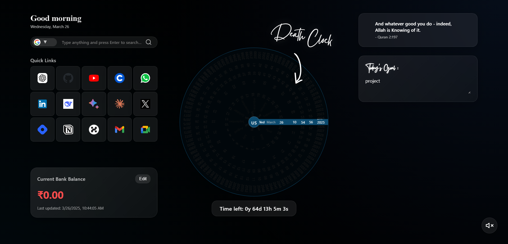

# Death Clock New Tab Extension

A beautiful, minimalist new tab replacement featuring a unique death clock visualization, daily goals, finance tracking, productivity tools, and inspirational Quran verses.



## Features

- **Death Clock Visualization**: A unique, circular time visualization showing your remaining time
- **Multi-language Support**: Supports 30+ languages with a beautiful flag selection interface
- **Daily Goals**: Set and track your daily objectives with auto-save functionality
- **Finance Tracking**: Monitor your bank balance with color-coded indicators
- **Quick Links**: Easy access to frequently used websites
- **Smart Search**: Integrated search with multiple engine options (Google, Bing, DuckDuckGo, ChatGPT)
- **Inspirational Quran Verses**: Meaningful verses that refresh every 30 minutes
- **Dynamic Greetings**: Time-based personalized greetings
- **Ambient Sound**: Optional ticking sound for ambiance
- **Responsive Design**: Works seamlessly on all devices

## Installation

### Chrome Web Store
1. Visit the Chrome Web Store (link coming soon)
2. Click "Add to Chrome"
3. Confirm the installation

### Manual Installation
1. Download this repository as a ZIP file and extract it
2. Create a `.env` file in the root directory with your Gemini API key:
   ```
   GEMINI_API_KEY=your_api_key_here
   ```
3. Open Chrome and navigate to `chrome://extensions/`
4. Enable "Developer mode" in the top-right corner
5. Click "Load unpacked" and select the extracted folder
6. The extension is now installed and will replace your new tab page

## Usage

### Setting Your Death Date
When you first open a new tab after installation, you'll be prompted to set your expected death date. This is used to visualize your remaining time.

### Tracking Finances
- Click the "Edit" button next to your balance to update it
- The balance color changes based on the amount (red for low, orange for medium, green for high)

### Daily Goals
- Type your daily goals in the text area
- Goals are automatically saved as you type

### Language Selection
- Click the language button in the center of the clock to change the interface language
- Select from 30+ languages with a beautiful flag selection interface

### Sound Toggle
- Click the sound icon in the bottom-right corner to toggle the ticking sound on/off

## Privacy

This extension:
- Stores all data locally on your device
- Does not collect or transmit any personal information
- Uses the Gemini API for fetching Quran verses (requires API key)

## API Keys

To use the Quran verse feature, you need a Gemini API key:
1. Get your API key from [Google AI Studio](https://makersuite.google.com/app/apikey)
2. Add it to your `.env` file as shown in the installation instructions
3. If no API key is provided, the extension will use a default verse

## Credits

- Clock design inspired by traditional timepieces
- Quran verses provided via Gemini API
- Icons and design elements from various open-source projects

## License

MIT License - Feel free to modify and distribute as needed

## Support

For issues, suggestions, or contributions, please open an issue on the GitHub repository or contact the developer directly.

## 🚀 Live Demo

Visit the live demo: [Death Clock Startup Page](https://hotheads-startup-page.vercel.app/)

## 💻 Setup as Your Startup Page

1. Visit this live url : 
2. In your browser settings, set the new tab/startup page to the demo URL
3. For Chrome:
   - Settings → On Startup → Open a specific page → Add a new page
   - Enter this url : https://hotheads-startup-page.vercel.app
   - save your settings 
4. For Firefox:
   - Settings → Home → Homepage and new windows → Custom URLs
   - Enter this url : https://hotheads-startup-page.vercel.app/
   - and save your settings

## 🛠️ Local Development

1. Clone the repository:
   ```bash
   git clone https://github.com/HOTHEAD01TH/death-clock-startup.git
   cd death-clock-startup
   ```

2. Open the project:
   - Use a local server (like Live Server in VS Code)
   - Or simply open `index.html` in your browser

3. Start developing:
   - Main files:
     - `index.html`: Page structure
     - `style.css`: Styling
     - `script.js`: Functionality

## 🤝 Contributing

We welcome contributions! Here's how you can help:

1. Fork the repository
2. Create a feature branch:
   ```bash
   git checkout -b feature/YourFeatureName
   ```
3. Commit your changes:
   ```bash
   git commit -m 'Add some feature'
   ```
4. Push to the branch:
   ```bash
   git push origin feature/YourFeatureName
   ```
5. Open a Pull Request

### Contribution Ideas

- Add new clock visualizations
- Implement additional productivity features
- Add more language support
- Improve accessibility
- Create themes/color schemes
- Add weather integration
- Implement task management
- Add custom quick link categories

## 📦 Deployment

This project is ready to deploy on Vercel:

1. Fork this repository
2. Sign up on [Vercel](https://vercel.com)
3. Create a new project and import your forked repository
4. Deploy!

## 🔧 Tech Stack

- HTML5
- CSS3 (Modern CSS features)
- Vanilla JavaScript
- Google Fonts
- Quotable API (for daily quotes)

## 📄 License

This project is licensed under the MIT License - see the [LICENSE](LICENSE) file for details.

## 🙏 Acknowledgments

- Clock overlay design inspired by modern UI trends
- Icons from various sources with appropriate credits

## 📞 Contact

For questions, suggestions, or contributions, please:
- Open an issue
- Submit a pull request
- Contact through GitHub discussions

---

Made with ❤️ by ZAID ADIL

*Note: This is an open-source project. Feel free to use, modify, and distribute following the license terms.* 
